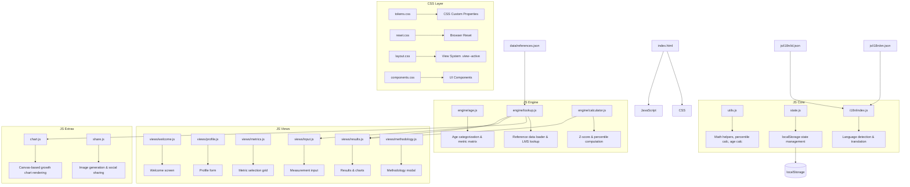
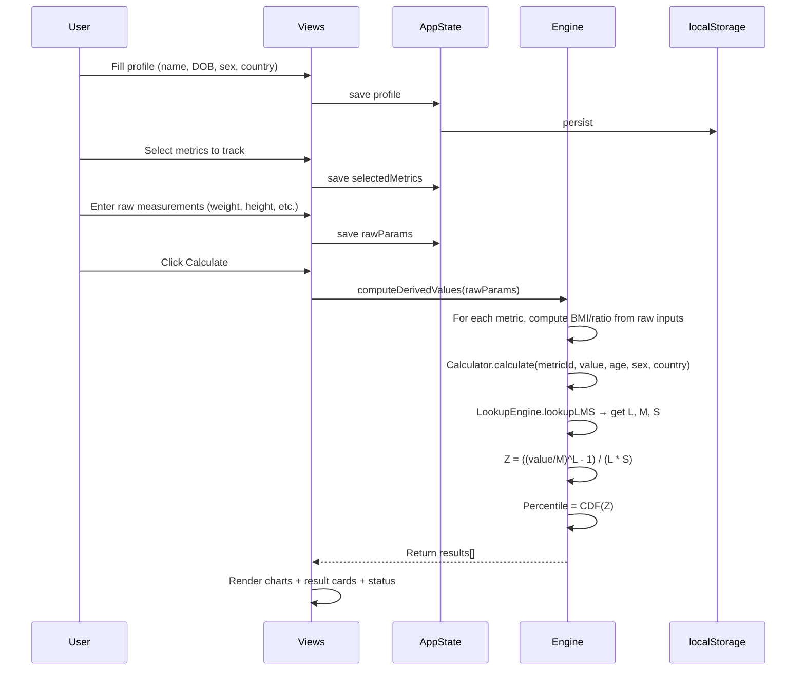

# EraTrack

> Growth Tracking for Every Life Stage — Privacy-first, no login, 100% on your device.

EraTrack is a client-side web application for monitoring growth across all life stages: infancy, childhood, adolescence, adulthood, and eldercare. It uses WHO, CDC, and Kemenkes reference standards to compute z-scores and percentiles for anthropometric measurements.

---

## Features

- **👶 Multi-stage tracking** — Infancy (0-2yr), Childhood (2-12yr), Adolescence (12-18yr), Adulthood (18-60yr), Elder Care (60+)
- **📏 Multiple metrics** — Height/Length, Weight, BMI, Head Circumference, Waist-to-Hip Ratio, and more
- **🌐 Multi-standard** — WHO, CDC, and Kemenkes (Indonesia) growth references
- **🌍 Bilingual** — English and Indonesian (auto-detects from IP)
- **🔒 100% Private** — All data stays in localStorage. Zero server requests.
- **📊 Growth charts** — Visual centile curves with your measurements plotted
- **📱 PWA-ready** — Works offline, mobile-friendly
- **👨‍👩‍👧‍👧 Multi-user** — Track different family members by refreshing and updating the profile

---

## Architecture



### Data Flow



---

## Getting Started

### Prerequisites

- A modern web browser (Chrome, Firefox, Safari, Edge)
- No server required — the app runs entirely in the browser

### Run Locally

```bash
# Clone the repository
git clone https://github.com/khafidhteer/eratrack.git
cd eratrack

# Option 1: Open directly (may not load reference data due to CORS)
open index.html

# Option 2: Serve with a local HTTP server (recommended)
# Using Python
python3 -m http.server 8080
# Then open http://localhost:8080

# Using Node.js (requires npx)
npx http-server . -p 8080
# Then open http://localhost:8080
```

> **Note:** Opening `index.html` directly via `file://` protocol may cause CORS errors when loading `data/references.json`. Always use an HTTP server for full functionality.

---

## Deploy to a VPS

EraTrack is a static site — no build step, no database, no backend. Any web server can serve it.

### Option A: Nginx

```bash
# Install nginx
sudo apt update && sudo apt install nginx -y

# Copy files to web root
sudo cp -r /path/to/eratrack/* /var/www/html/
# or deploy to a subdirectory
sudo mkdir -p /var/www/eratrack
sudo cp -r /path/to/eratrack/* /var/www/eratrack/

# Configure nginx (if deploying to root)
sudo tee /etc/nginx/sites-available/eratrack << 'EOF'
server {
    listen 80;
    server_name eratrack.yourdomain.com;

    root /var/www/eratrack;
    index index.html;

    location / {
        try_files $uri $uri/ /index.html;
    }

    location ~* \.(json)$ {
        add_header Access-Control-Allow-Origin "*";
        expires -1;
    }
}
EOF

# Enable and restart
sudo ln -s /etc/nginx/sites-available/eratrack /etc/nginx/sites-enabled/
sudo rm /etc/nginx/sites-enabled/default
sudo nginx -t && sudo systemctl reload nginx
```

### Option B: Apache

```bash
# Install apache
sudo apt update && sudo apt install apache2 -y

# Copy files
sudo cp -r /path/to/eratrack/* /var/www/html/

# Enable CORS for JSON files if needed
sudo a2enmod headers
sudo tee -a /etc/apache2/sites-available/000-default.conf << 'EOF'
<Directory /var/www/html>
    Header set Access-Control-Allow-Origin "*"
</Directory>
EOF
sudo systemctl reload apache2
```

### Option C: Caddy (automatic HTTPS)

```bash
# Install caddy
sudo apt install -y debian-keyring debian-archive-keyring apt-transport-https
curl -1sLf 'https://dl.cloudsmith.io/public/caddy/stable/gpg.key' | sudo gpg --dearmor -o /usr/share/keyrings/caddy-stable-archive-keyring.gpg
curl -1sLf 'https://dl.cloudsmith.io/public/caddy/stable/debian.deb.txt' | sudo tee /etc/apt/sources.list.d/caddy-stable.list
sudo apt update && sudo apt install caddy -y

# Create Caddyfile
sudo tee /etc/caddy/Caddyfile << 'EOF'
eratrack.yourdomain.com {
    root * /var/www/eratrack
    file_server
    encode gzip
}
EOF

# Copy files and start
sudo cp -r /path/to/eratrack/* /var/www/eratrack/
sudo systemctl restart caddy
```

### Option D: Python (quick, development only)

```bash
# Install and run with systemd or tmux/screen
sudo apt install python3 -y
cd /path/to/eratrack
nohup python3 -m http.server 80 > server.log 2>&1 &
```

### DNS Setup

1. Point your domain's A record to your VPS IP address
2. Wait for DNS propagation (can take minutes to hours)
3. (Optional) Set up a reverse proxy with Certbot/Let's Encrypt for HTTPS:

```bash
sudo apt install certbot python3-certbot-nginx -y
sudo certbot --nginx -d eratrack.yourdomain.com
```

---

## File Structure

```
eratrack/
├── index.html                    # Main entry point
├── assets/
│   └── favicon.svg               # App icon
├── css/
│   ├── tokens.css                # Design tokens (colors, spacing, fonts)
│   ├── reset.css                 # CSS reset / normalize
│   ├── layout.css                # Layout system, grid, views
│   └── components.css            # UI components (buttons, forms, cards, modals)
├── data/
│   └── references.json           # WHO/CDC/Kemenkes LMS reference tables
├── js/
│   ├── app.js                    # Application controller, view routing
│   ├── chart.js                  # Canvas-based growth chart renderer
│   ├── share.js                  # Image generation and social sharing
│   ├── state.js                  # localStorage-backed state management
│   ├── utils.js                  # Math helpers, date utils, CDF
│   ├── engine/
│   │   ├── age.js                # Age categorization & metric matrix
│   │   ├── calculator.js         # Z-score and percentile computation
│   │   └── lookup.js             # Reference data loader & LMS lookup
│   ├── i18n/
│   │   ├── index.js              # i18n engine (detect, load, translate)
│   │   ├── en.json               # English translations
│   │   └── id.json               # Indonesian translations
│   └── views/
│       ├── welcome.js            # Welcome / landing view
│       ├── profile.js            # Profile form (name, DOB, sex, country)
│       ├── metrics.js            # Metric selection grid
│       ├── input.js              # Measurement input (deduplicated raw params)
│       ├── results.js            # Results display, charts, z-scores
│       └── methodology.js        # Calculation methodology modal
└── README.md                     # This file
```

---

## Technology Stack

| Layer | Technology |
|-------|-----------|
| **UI** | Vanilla HTML5 + CSS3 (no frameworks) |
| **Logic** | Vanilla JavaScript (ES6 modules via IIFE) |
| **Charts** | Custom Canvas 2D rendering |
| **State** | `localStorage` |
| **i18n** | Custom JSON-based translation engine |
| **Reference Data** | WHO Child Growth Standards (2006), CDC Growth Charts (2000), Kemenkes Standar Antropometri (2020) |
| **Dependencies** | None. Zero npm packages. Zero CDN links. |

---

## License

MIT License

Copyright (c) 2026 Khafidhteer

Permission is hereby granted, free of charge, to any person obtaining a copy
of this software and associated documentation files (the "Software"), to deal
in the Software without restriction, including without limitation the rights
to use, copy, modify, merge, publish, distribute, sublicense, and/or sell
copies of the Software, and to permit persons to whom the Software is
furnished to do so, subject to the following conditions:

The above copyright notice and this permission notice shall be included in all
copies or substantial portions of the Software.

THE SOFTWARE IS PROVIDED "AS IS", WITHOUT WARRANTY OF ANY KIND, EXPRESS OR
IMPLIED, INCLUDING BUT NOT LIMITED TO THE WARRANTIES OF MERCHANTABILITY,
FITNESS FOR A PARTICULAR PURPOSE AND NONINFRINGEMENT. IN NO EVENT SHALL THE
AUTHORS OR COPYRIGHT HOLDERS BE LIABLE FOR ANY CLAIM, DAMAGES OR OTHER
LIABILITY, WHETHER IN AN ACTION OF CONTRACT, TORT OR OTHERWISE, ARISING FROM,
OUT OF OR IN CONNECTION WITH THE SOFTWARE OR THE USE OR OTHER DEALINGS IN THE
SOFTWARE.

---

## Reference Standards

- **WHO** — World Health Organization Child Growth Standards (2006) for children 0-5 years; WHO Growth Reference (2007) for ages 5-19
- **CDC** — Centers for Disease Control and Prevention growth charts (2000) for ages 2-20 years
- **Kemenkes** — Kementerian Kesehatan Republik Indonesia Standar Antropometri Penilaian Status Gizi Anak (2020) for ages 0-5 years

### Calculation Methodology

Z-scores are calculated using the LMS method:

```
Z = ((Value / M)^L − 1) / (L × S)
```

Where:
- **L** — Lambda (Box-Cox power transformation)
- **M** — Mu (median reference value)
- **S** — Sigma (coefficient of variation)

Percentiles are derived from the Z-score using the standard normal cumulative distribution function (CDF).
